# Лабораторная работа №6
- **Создан аккаунт на сайте GitHuib**

*https://github.com/CyberResearcher*

- **Создана копия репозитория (Fork) в личное хранилище**

*https://github.com/CyberResearcher/LR6*

- **Установлен и настроен Git**

С помощью команд `git config --global user.name <username>` и `git config --global user.name <username>`
вводим имя пользователя и email

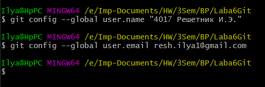

- **Клонирование удаленного репозитория на копьютер с помощью команды** `git clone <url>`

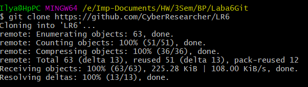

- **Добавление файла** *Added-file* **через интерфейс GitHub и запрос его для локального репозитория командой** `git pull`

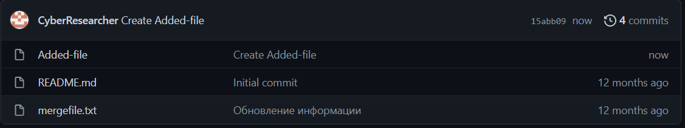

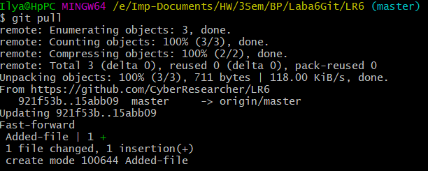

### Локальная работа

- **Получение истории операций для каждой из веток командами ** `git log` ** для отчета и ** `git checkout <branch>` * для переключения веток*

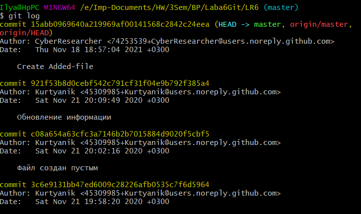

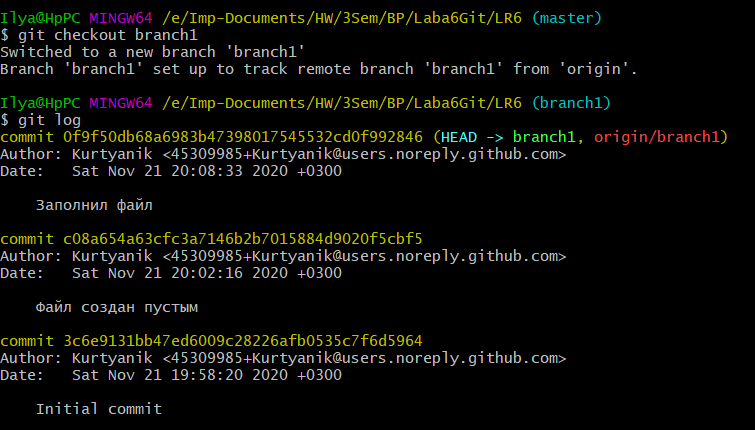

- **Попытка слияния веток**

Для исправления конфликта вручную открываем файл mergefile.txt блокнотом командой `notepad mergefile.txt` и корректируем текст

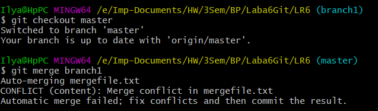

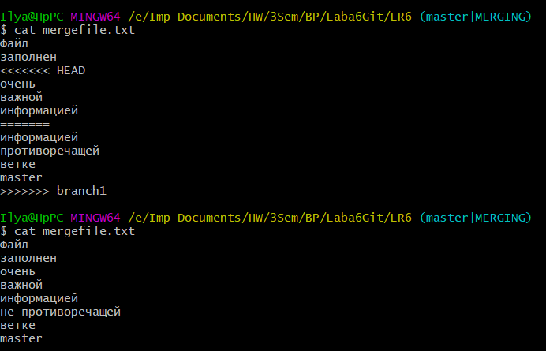

Теперь индексируем и коммитим исправленный файл командами `git add <file>` и `git commit -m <commit name>`

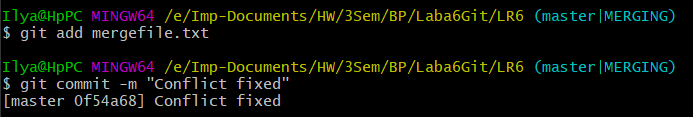

- **Удаление побочной ветки**

Удаляем побочную ветку из локального и удаленного репозитория командами `git branch -d <branch>` и `git push <url> --delete <branch>` соответственно 

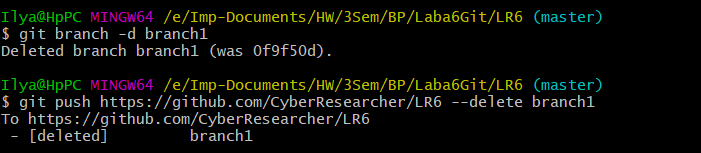

- **Несколько важных изменений**

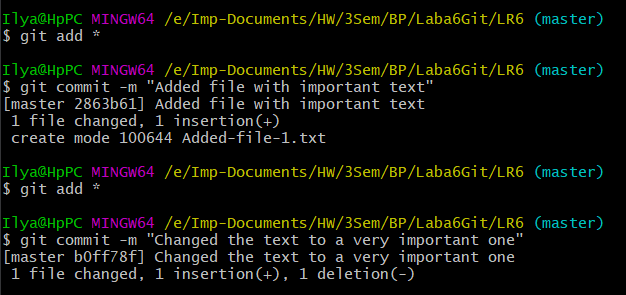

- **Хард откат ~~важного~~ коммита**

Хард ресет коммита производим командой `git reset --hard <commit>`

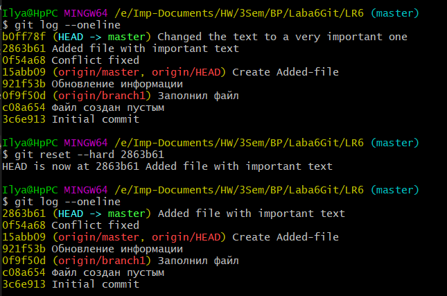

- **Создание ветки для отчета**

Создаем и сразу переключаемся на ветку отчета командой `git checkout -b report`

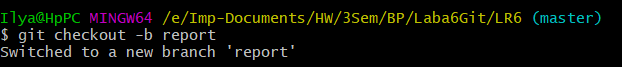

### Отчет

История изменений в форматированном виде с помощью команды `git log --pretty=format:"%C(yellow) %h %Cgreen %as %Cred %an %Creset %s"`

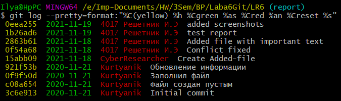